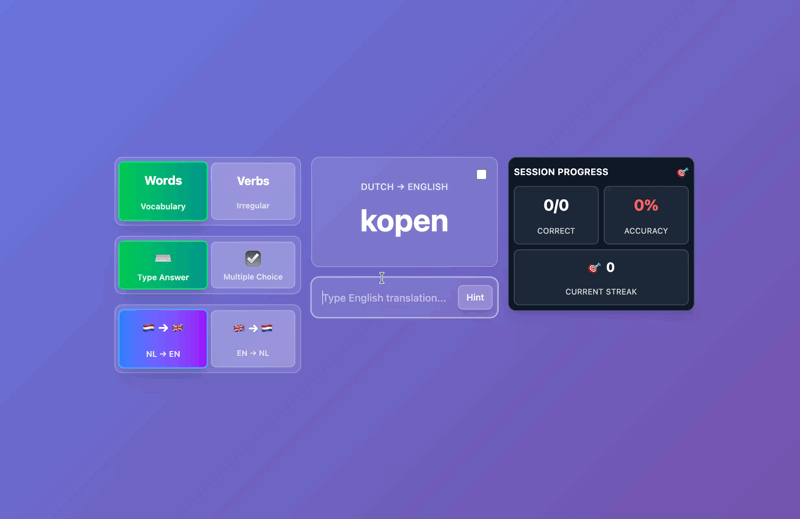

# 🇳🇱 Dutch Language Learning App

A comprehensive, AI-powered Dutch language learning platform with vocabulary and verb conjugation practice. Features intelligent hints, progress tracking, and multiple learning modes. Built with React, TypeScript, and Tailwind CSS.



## 🎉 Recently Added

### **Sentence Practice Mode** 📝
- **Scrambled Construction**: Build full Dutch sentences from word banks (with distractors) for translation practice
- **Two Formats**: Construct via word bank drag/click or type the full sentence directly
- **Fuzzy Acceptance**: Minor typos and near-miss words are accepted and highlighted, including pronoun variants (`we/wij`, `ze/zij`)
- **Transparent Feedback**: Side-by-side “your answer vs correct” with per-word highlights for quick fixes
- **Deliberate Flow**: Wrong or fuzzy-correct answers stay on the same card until you click “Next Sentence”
- **Hint Support**: Progressive hints and AI hover hints carry over to sentences for guided learning

### **Confetti Celebration Effects** ✨
- **Visual Rewards**: Animated confetti particles burst when you answer correctly
- **Multi-burst Animation**: Different angles and velocities for dynamic celebrations
- **Gamification**: Immediate positive reinforcement to boost motivation and engagement

### **Multiple Choice Practice Format** ☑️
- **Flexible Learning Modes**: Choose between typing answers or selecting from multiple choices
- **Smart Distractors**: Intelligent generation of similar-length incorrect options
- **Keyboard Shortcuts**: Press 1-4 to quickly select options
- **Recognition vs Recall**: Switch between easier (multiple choice) and harder (typing) practice

### **Enhanced AI Hints System** 🧠
- **Intelligent Caching**: AI-generated hints are cached to reduce API calls and improve performance
- **Background Preloading**: Next question's hints load in the background for seamless experience
- **A2-Level Filtering**: Advanced quality filtering ensures examples are appropriate for language learners
- **Dual Strategy**: Combines real-world search results with AI generation for optimal hint quality

### **Custom Theme Creator** 🎨
- **Full Customization**: Design your own color schemes with live preview
- **Advanced Color Options**: Customize backgrounds, gradients, text, feedback colors, and more
- **Built-in Themes**: New Dark/OLED mode plus enhanced existing themes
- **Live Preview Panel**: See your changes instantly before applying

## ✨ Features

### 📚 **Dual Content Types**

- **Vocabulary Learning**: Practice Dutch-English word pairs from curated datasets
- **Irregular Verbs**: Master Dutch verb conjugations with infinitive, imperfectum, and perfectum forms

### 🎯 **Multiple Learning Modes**

- 🔄 **Word Modes**: Dutch → English and English → Dutch translation
- 🔀 **Verb Modes**: Random forms, Infinitive focus, Imperfectum practice, Perfectum training
- ⌨️ **Practice Formats**: Choose between typing answers or multiple choice questions
- ☑️ **Multiple Choice**: Smart distractor generation with keyboard shortcuts (1-4)

### 🤖 **AI-Powered Learning**

- **Smart Hints**: AI-generated contextual examples and usage tips via Perplexity API
- **Progressive Hint System**: 4-level hint progression from subtle to explicit
- **Hover Context**: Instant example sentences for better understanding
- **Intelligent Caching**: Background preloading and caching for seamless hint delivery
- **A2-Level Filtering**: Quality-assured examples appropriate for language learners

### 📊 **Advanced Analytics**

- **Progress Tracking**: Session statistics and comprehensive all-time metrics
- **Hint Analytics**: Track hint usage patterns and learning efficiency
- **Streak System**: Build and maintain learning streaks across content types
- **Known Words Management**: Mark and manage already-learned vocabulary

### 🎨 **Modern Experience**

- **Enhanced Theme System**: Built-in themes (Default, Duo, Dark/OLED) plus custom theme creator
- **Custom Theme Designer**: Full color customization with live preview
- **Celebration Effects**: Confetti animations for correct answers with gamification rewards
- **Smart Fuzzy Matching**: Accepts minor typos and spelling variations
- **Responsive Design**: Optimized for desktop, tablet, and mobile devices
- **Beautiful UI**: Smooth animations, gradients, and intuitive micro-interactions
- **Local Storage**: Automatic progress saving with persistent data

## 🚀 Quick Start

### Prerequisites

- Node.js (v18 or higher)
- npm or yarn

### Installation

1. **Clone and install dependencies:**

   ```bash
   git clone <repository-url>
   cd fresher
   npm install
   ```

2. **Start development server:**

   ```bash
   npm run dev
   ```

3. **Open your browser:**
   Navigate to `http://localhost:5173`

### Build for Production

```bash
npm run build
npm run preview  # Preview the production build
```

## 🎯 How to Use

### Getting Started

1. **Choose Content Type**: Select between Words or Irregular Verbs learning
2. **Select Learning Mode**: Pick your preferred mode (translation directions or verb forms)
3. **Configure AI Hints** (Optional): Set up Perplexity API key for AI-powered contextual hints

### Learning Flow

1. **Study the Content**: A word or verb form will be displayed
2. **Choose Practice Format**: Select between typing answers or multiple choice questions
3. **Use Smart Hints**: Hover over words for AI-generated examples, or use progressive hints if stuck
4. **Submit Your Answer**: Type the translation/conjugation or select from multiple choice options
5. **Celebrate Success**: Enjoy confetti animations when you answer correctly!
6. **Get Instant Feedback**: Receive immediate validation with fuzzy matching tolerance
7. **Mark Known Items**: Checkbox items you already know to focus on challenging content
8. **Track Progress**: Monitor accuracy, streaks, hint usage, and learning analytics

### Advanced Features

- **Statistics Dashboard**: View comprehensive metrics including hint analytics and known words management
- **Theme Switching**: Personalize your learning environment with different visual themes
- **Persistent Progress**: All data automatically saves locally for seamless session continuity

## 🛠️ Tech Stack

- **Frontend**: React 19 + TypeScript
- **Styling**: Tailwind CSS with custom animations and themes
- **Build Tool**: Vite
- **Data Processing**: Papa Parse for CSV datasets
- **State Management**: React Context + Hooks
- **AI Integration**: Perplexity API for intelligent hints with caching
- **Animations**: Canvas Confetti for celebration effects
- **Testing**: Vitest with UI support
- **Storage**: Browser LocalStorage with advanced data structures
- **UI Components**: Custom responsive components with accessibility features

## 📁 Project Structure

```
src/
├── components/           # React components
│   ├── WordCard.tsx             # Displays words with AI hints
│   ├── VerbCard.tsx             # Displays verbs with conjugation practice
│   ├── InputField.tsx           # Smart input with validation feedback
│   ├── MultipleChoiceInput.tsx  # Multiple choice answer selection
│   ├── PracticeFormatSwitcher.tsx # Toggle between input/multiple choice
│   ├── ModeToggle.tsx           # Content type and mode switcher
│   ├── VerbModeSelector.tsx     # Verb-specific mode selection
│   ├── ContentTypeSwitcher.tsx  # Switch between words/verbs
│   ├── ProgressIndicator.tsx    # Real-time session progress
│   ├── StatsDashboard.tsx       # Comprehensive analytics dashboard
│   ├── ThemeChooser.tsx         # Enhanced theme selection
│   ├── CustomThemeDialog.tsx    # Custom theme creator with live preview
│   ├── ColorPicker.tsx          # Color picker for custom themes
│   ├── AIHintConfigDialog.tsx   # AI hint system configuration
│   ├── AIHintPopup.tsx          # AI hint display popup
│   ├── HintButton.tsx           # Hint trigger button
│   ├── ConfettiEffect.tsx       # Celebration animation effects
│   └── KnownWordsManager.tsx    # Known vocabulary management
├── contexts/            # React contexts
│   ├── ThemeContext.tsx         # Enhanced theme state management
│   └── AIHintContext.tsx        # AI hint configuration with caching
├── utils/               # Utility functions
│   ├── csvParser.ts             # Multi-dataset CSV processing
│   ├── fuzzyMatch.ts            # Advanced fuzzy string matching
│   ├── wordManager.ts           # Content selection and filtering
│   ├── verbManager.ts           # Verb conjugation handling
│   ├── multipleChoiceGenerator.ts # Smart distractor generation
│   ├── hintGenerator.ts         # Hint generation logic
│   └── storage.ts               # Enhanced LocalStorage utilities
├── services/            # External services
│   └── aiHintService.ts         # Perplexity API integration with caching
├── types/               # TypeScript type definitions
│   ├── index.ts                 # Main type exports
│   └── theme.ts                 # Theme-related types
├── App.tsx             # Main application with context providers
└── main.tsx            # Application entry point

public/
└── data/
    ├── dutch_common_words.csv     # Vocabulary dataset
    └── dutch_irregular_verbs.csv  # Verb conjugation dataset
```

## 🎨 Features in Detail

### 🎉 **New Feature Highlights**

#### **Confetti Celebration System**
- **Multi-burst Animation**: Dynamic confetti particles with varying angles and velocities
- **Color Psychology**: Green/gold colors for success reinforcement
- **Performance Optimized**: Canvas-based rendering with proper cleanup
- **Immediate Feedback**: Synchronized with answer validation for instant gratification

#### **Multiple Choice Practice Mode**
- **Smart Distractor Generation**: Similar-length incorrect options for cognitive challenge
- **Keyboard Navigation**: Press 1-4 keys for quick selection without mouse
- **Visual Feedback System**: Color-coded correct/incorrect responses with animations
- **Flexible Learning**: Switch between recognition (MC) and recall (typing) practice

#### **Advanced Custom Themes**
- **Live Preview Panel**: See changes instantly as you customize colors
- **Gradient Support**: Full gradient customization for backgrounds and mode switchers
- **Advanced Settings**: Collapsible section for detailed styling (input, buttons, hints)
- **Built-in Theme Library**: Default, Duo, Dark/OLED, plus unlimited custom options

#### **Enhanced AI Hints with Caching**
- **Intelligent Preloading**: Background loading of next question's hints
- **Dual Strategy System**: Real-world search + AI generation for optimal quality
- **A2-Level Content Filtering**: Advanced filtering ensures appropriate difficulty
- **Performance Cache**: Reduced API calls with persistent hint storage

### 🤖 AI-Powered Hints System

- **Perplexity Integration**: Real-time AI-generated contextual examples and usage tips
- **Progressive Disclosure**: 4-level hint system from subtle clues to explicit answers
- **Hover Context**: Instant example sentences appear on word hover
- **Smart Configuration**: Easy API key setup with validation and testing
- **Usage Analytics**: Track hint effectiveness and learning patterns

### 🧠 Intelligent Answer Validation

- **Advanced Fuzzy Matching**: Accepts minor typos (up to 2 character differences)
- **Case Insensitive**: Flexible input handling for natural typing
- **Multiple Answer Support**: Handles alternative answers separated by `/` or `,`
- **Punctuation Normalization**: Smart whitespace and punctuation handling
- **Verb Form Recognition**: Specialized validation for Dutch verb conjugations

### 📈 Comprehensive Analytics

- **Multi-Dimensional Tracking**: Words, verbs, hints, streaks, and accuracy metrics
- **Session vs. All-Time**: Detailed breakdowns of current and historical performance
- **Learning Insights**: Hint usage trends, difficulty patterns, and progress visualization
- **Known Words Management**: Track mastered vocabulary with easy unmarking options
- **Motivational Feedback**: Context-aware encouragement based on performance patterns

### 🎨 Enhanced User Experience

- **Multi-Theme Support**: Ocean and Duo themes with smooth transitions
- **Responsive Design**: Optimized layouts for desktop, tablet, and mobile devices
- **Smooth Animations**: Fade-ins, slide-ups, hover effects, and micro-interactions
- **Keyboard Navigation**: Full keyboard support with Enter submissions
- **Visual Feedback**: Color-coded feedback system for learning reinforcement
- **Content Type Switching**: Seamless transitions between words and verb modes

## 📊 Data Structure

### Vocabulary Dataset (`dutch_common_words.csv`)

```csv
Dutch,English
hond,dog
kat,cat
huis,house
auto,car
```

### Irregular Verbs Dataset (`dutch_irregular_verbs.csv`)

```csv
Infinitive,Imperfectum,Perfectum,English
zijn,was/waren,geweest,to be
hebben,had/hadden,gehad,to have
gaan,ging/gingen,gegaan,to go
komen,kwam/kwamen,gekomen,to come
```

## 🎨 Customization

### Adding Content

1. **Vocabulary**: Edit `public/data/dutch_common_words.csv` following the `Dutch,English` format
2. **Irregular Verbs**: Edit `public/data/dutch_irregular_verbs.csv` with `Infinitive,Imperfectum,Perfectum,English` columns
3. Restart the development server to load new content

### AI Hints Configuration

1. Obtain a Perplexity API key from [perplexity.ai](https://www.perplexity.ai)
2. Use the in-app configuration dialog to set up AI hints
3. Test the integration with the built-in validation system

### Theme Customization

- **Built-in Themes**: Switch between Default, Duo, and Dark/OLED themes via the enhanced theme chooser
- **Custom Theme Creator**: Use the in-app designer with live preview to create personalized themes
- **Advanced Color Options**: Customize backgrounds, gradients, text colors, feedback colors, and UI elements
- **Gradient Support**: Full gradient customization for mode switchers and backgrounds
- **Live Preview**: See your changes instantly with the built-in preview panel
- **Persistent Storage**: Custom themes automatically save to localStorage
- **Developer Customization**: Modify `src/index.css` for global styles or `tailwind.config.js` for new animations

## 🚀 Deployment

This app is ready for deployment on:

- **Netlify**: Drag and drop the `dist` folder
- **Vercel**: Connect your Git repository
- **GitHub Pages**: Use GitHub Actions for automatic deployment

## 📝 License

This project is open source and available under the MIT License.

## 🤝 Contributing

Contributions are welcome! Please feel free to submit a Pull Request.

---

**Happy Learning! 🎉 Veel succes met het leren van Nederlands! 🇳🇱**
